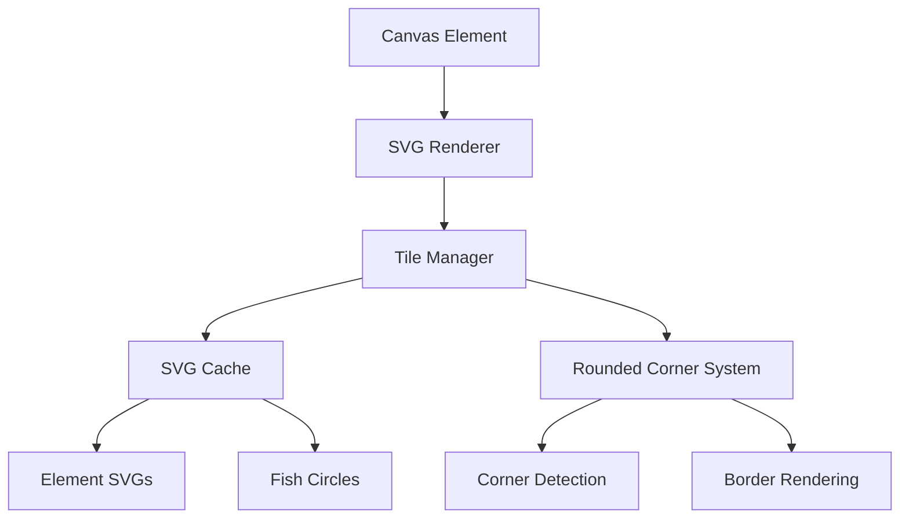

# Design Document

## Overview

The modular fish ecosystem mapmaker extends the existing sandspiel simulation by replacing the current pixel-based rendering with an efficient SVG-based tile system. The design integrates fish and ship elements into the existing element framework, adds specialized game elements (harbor, city, etc.), implements dynamic map sizing with camera controls, and provides export functionality for standalone gameplay.

## Architecture

### Core System Integration

The design leverages the existing sandspiel architecture:
- **Element System**: Fish and ships are implemented as elements within the current `globalState.updaters` array
- **Rendering Pipeline**: Replace WebGL pixel rendering with SVG-based tile rendering while maintaining performance
- **Simulation Loop**: Utilize existing `tick()` function and update schemes for fish behaviors and ship mechanics
- **State Management**: Extend current Zustand store for new game-specific state

### SVG Rendering Architecture



## Components and Interfaces

### 1. SVG Tile System

**SvgTileRenderer Component**
```javascript
class SvgTileRenderer {
  constructor(canvas, width, height)
  renderTile(x, y, elementType, color)
  renderCircle(x, y, diameter, color)
  updateTileCache()
  applyRoundedCorners(x, y, neighbors)
}
```

**Key Features:**
- Efficient SVG caching system for repeated elements
- Dynamic rounded corner calculation based on adjacent tiles
- Circle rendering for fish elements with diameter matching harbor.svg hole (20px radius)
- Tile size matching current pixel system dimensions

### 2. Enhanced Element System

**Fish Elements (8 types)**
```javascript
// Integrated into existing globalState.updaters array
const fishElements = {
  pearl: { id: 5, color: 'lightblue', behavior: 'orca' },
  seaLion: { id: 6, color: 'purple', behavior: 'predator' },
  octopus: { id: 7, color: 'pink', behavior: 'intelligent' },
  seaOtter: { id: 8, color: 'yellow', behavior: 'playful' },
  seaUrchin: { id: 9, color: 'orange', behavior: 'stationary' },
  cod: { id: 10, color: 'gold', behavior: 'schooling' },
  squid: { id: 11, color: 'lime', behavior: 'evasive' },
  crab: { id: 12, color: 'red', behavior: 'scavenger' }
}
```

**Ship Element**
```javascript
const shipElement = {
  id: 13,
  behavior: 'ship',
  properties: {
    team: 'number',
    trailColor: 'white',
    captureRadius: 1,
    score: 0
  },
  restrictions: {
    onePerTeam: true  // Unlike other mapmaking elements, only one ship per team
  }
}
```

**Specialized Tile Elements**
```javascript
const tileElements = {
  island: { id: 1, svg: 'island.svg', color: 'black', behavior: 'wall' },
  harbor: { id: 14, svg: 'harbor.svg', behavior: 'spawn' },
  city: { id: 15, svg: 'city.svg', behavior: 'market' },
  homeHarbor: { id: 16, svg: 'homeharbor.svg', behavior: 'teamSpawn' },
  homeIsland: { id: 17, svg: 'homeisland.svg', color: 'lime', behavior: 'wall' }
}
```

### 3. Dynamic Map System

**MapManager Component**
```javascript
class MapManager {
  constructor()
  setMapDimensions(width, height)
  initializeCamera()
  updateViewport()
  exportMapData()
  importMapData(data)
}
```

**Camera System**
```javascript
class GameCamera {
  constructor(containerElement)
  pan(deltaX, deltaY)
  zoom(factor)
  centerOn(x, y)
  getViewBounds()
}
```

### 4. Fish Behavior System

**Behavior Engine**
```javascript
class FishBehaviorEngine {
  constructor()
  registerBehavior(fishType, behaviorFunction)
  executePredatorPrey()
  updateEcosystem()
  calculatePopulationDynamics()
}
```

**Predator-Prey Relationships:**
- Orca (Pearl) → Sea Lion, Cod, Squid
- Sea Lion → Cod, Squid, Crab
- Octopus → Crab, Sea Urchin
- Sea Otter → Sea Urchin, Crab
- Cod → Sea Urchin (algae simulation)
- Squid ↔ Cod (mutual predation)
- Crab → Sea Urchin (scavenging)

### 5. Ship Mechanics System

**Ship Controller**
```javascript
class ShipController {
  constructor(shipElement)
  move(direction)
  createTrail(position)
  captureInstant(fishElement)
  captureAdjacent()
  detectLoop(trailPositions)
  calculateScore()
}
```

**Team Ship Manager**
```javascript
class TeamShipManager {
  constructor()
  validateShipPlacement(team, position)
  getTeamShip(teamId)
  enforceOneShipPerTeam(teamId)
  removeExistingTeamShip(teamId)
}
```

**Trail System:**
- Trail elements created automatically behind ship movement
- Loop detection algorithm for trail preservation
- Adjacent fish capture on simulation tick
- Team scoring system integration

**Ship Placement Restrictions:**
- Unlike other mapmaking elements (harbor, city, fish), ships have a one-per-team restriction
- When placing a ship for a team that already has one, the existing ship is removed
- Team ship validation occurs during both mapmaking and testing phases
- Ship restrictions are preserved in exported map configurations

## Data Models

### Element Data Structure
```javascript
const elementData = {
  id: number,           // Element type identifier
  x: number,           // Grid position X
  y: number,           // Grid position Y
  ra: number,          // Random/behavior data
  rb: number,          // Secondary behavior data
  rc: number,          // Tertiary behavior data
  svg: string,         // SVG file reference (for tile elements)
  color: string,       // Color override for circles
  team: number         // Team assignment (for ships)
}
```

### Map Configuration
```javascript
const mapConfig = {
  dimensions: { width: number, height: number },
  elements: elementData[],
  fishPopulations: { [fishType]: number },
  teamSpawns: { [teamId]: position[] },
  winConditions: configurable[],
  metadata: {
    name: string,
    description: string,
    created: timestamp
  }
}
```

### Camera State
```javascript
const cameraState = {
  position: { x: number, y: number },
  zoom: number,
  bounds: { minX, maxX, minY, maxY },
  viewport: { width: number, height: number }
}
```

## Error Handling

### SVG Rendering Errors
- Fallback to colored rectangles if SVG fails to load
- Graceful degradation for missing SVG files
- Performance monitoring for rendering bottlenecks

### Element System Errors
- Validation for element placement within map bounds
- Conflict resolution for overlapping elements
- Behavior function error catching and logging

### Map Size Errors
- Boundary checking for camera movement
- Memory management for large map sizes
- Performance optimization for viewport culling

## Testing Strategy

### Unit Testing Focus
- SVG tile rendering accuracy
- Fish behavior algorithms
- Ship movement and capture mechanics
- Map export/import data integrity

### Integration Testing
- Element system compatibility with existing simulation
- Camera controls with map boundaries
- Performance testing with large fish populations
- Cross-browser SVG rendering compatibility

### User Testing Scenarios
- Map creation workflow validation
- Team selection and testing interface
- Export/import functionality verification
- Performance testing with various map sizes

## Performance Considerations

### SVG Optimization
- SVG sprite caching system
- Viewport culling for off-screen elements
- Efficient rounded corner calculation
- Minimal DOM manipulation

### Simulation Performance
- Optimized fish behavior calculations
- Efficient ship trail management
- Memory-conscious element storage
- Configurable update frequencies

### Rendering Pipeline
- Canvas-based SVG rendering for performance
- Batch rendering operations
- Efficient dirty region tracking
- Smooth camera movement interpolation

## Implementation Phases

### Phase 1: SVG Rendering Foundation
- Replace pixel rendering with SVG system
- Implement basic tile rendering
- Add rounded corner system
- Integrate with existing element buttons

### Phase 2: Fish and Ship Elements
- Add fish elements to element system
- Implement basic fish behaviors
- Create ship element with trail mechanics
- Add instant and timed capture systems

### Phase 3: Specialized Tiles and Map System
- Implement harbor, city, island elements
- Add dynamic map sizing controls
- Create camera system with pan/zoom
- Add map border visualization

### Phase 4: Export and Testing Interface
- Build map export functionality
- Create standalone player component
- Add team selection interface
- Implement testing mode controls